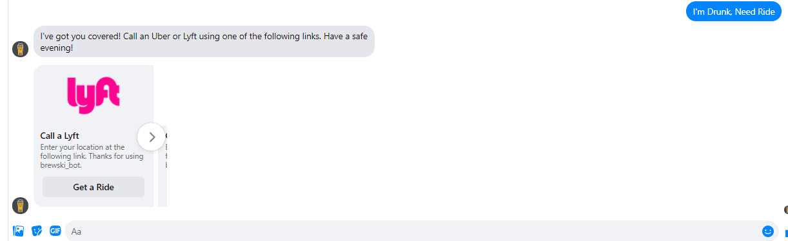

# brewski_bot_fb
brewski_bot is an online assistant for beer drinkers. A virtual drinking buddy. brewskit_bot communicates through FB Messenger with Dialogflow and Node.js, using Heroku as a webhook.

## How brewski_bot Works 🤖
Start your conversation with brewski_bot using any greeting:

Say Menu at any time to bring up brewski_bot's search menu:

## Brewery Search 🌎
Choosing "Brewery Search" prompts you to choose whether to search for a brewery by name or by city. brewski_bot will return a series of cards that match the user's search query. This was made possible by OpenBreweryDB's free dataset and API. Google's Places API was also used to return the corresponding Google Maps stock photo for each location.

### Search by name:

### Search by city:

Pressing the "View Website" links will take you to the brewery's website (obviously), and pressing the "Get Directions" link will give you corresponding Google Maps pin of the location. 

<b>For more information on OpenBreweryDB visit their [website](https://www.openbrewerydb.org/).</b>

## Beer Info 🍺
Choosing "Beer Info" prompts the user to enter keywords to find an individual beer. Then a single card will be returned which corresponds to the beer that comes up first for that search query on beeradvocate.com. Since there is currently no API for fetching data on individual beers I got a little creative. This was done by creating a web scraper with the Axios and Cheerio libraries. After the input is received from the user, the top result matching the query from beeradvocate.com is fetched. Then a second request is sent out and the profile page of the top result is scraped to return the type of beer that it is, the ABV percentage, the brewery of origin, and a photo.

### Searching by beer:

Pressing the "Full Profile" link takes you to the profile page for the beer where more detailed info and community comments on the beer can be viewed.

## I'm Drunk, Need Ride 🚕
Choosing "I'm Drunk, Need Ride" is the simplest of brewski_bot's features. brewski_bot returns a couple of cards that take the user to Uber and Lyft's landing pages. Integrating an actual ride-share API into the bot will have to be a project for another day. Like any good drinking buddy, brewski_bot doesn't let friends get behind the wheel!

### Call ridesharing

